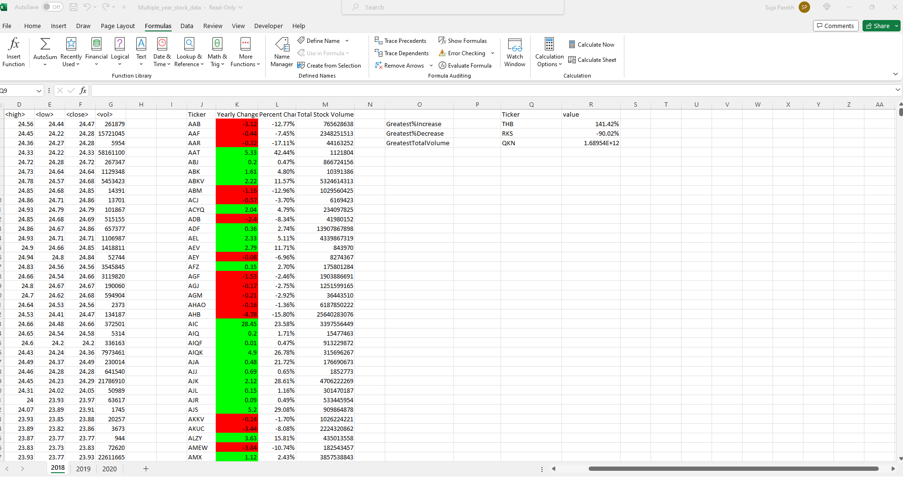
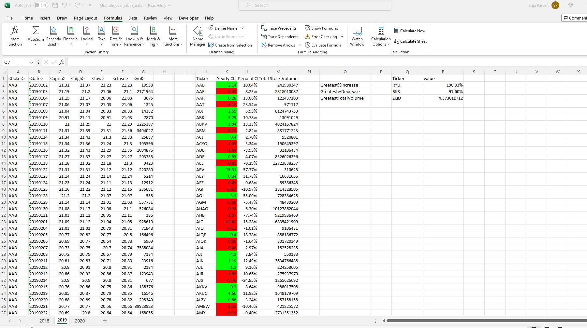
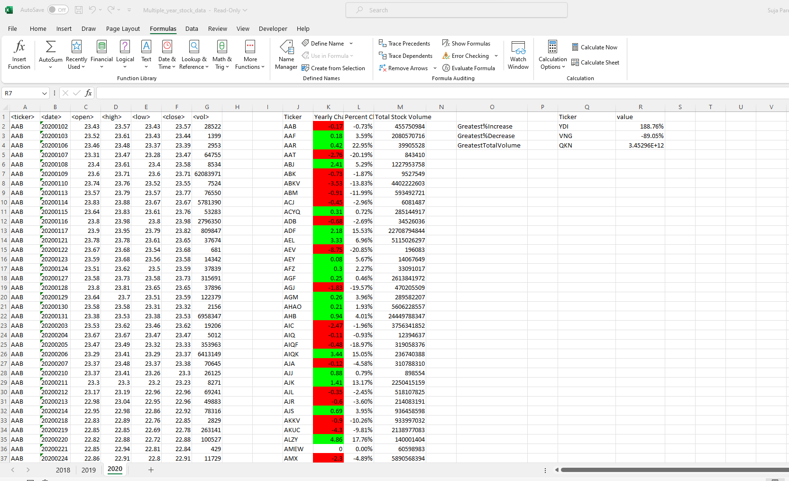

# Stock Data Analysis

## Module 1 - Stocks

 * Iterate through the entire worksheet
 * Find unique ticker
     * Store ticker value in a variable 
     * Iterate over each row and compare the ticker value with the stored value
     * Record the ticker if no match
 * Find Yearly Change For Each Ticker
     * Record the opening price of the date - 01/02
     * Record the closing price of the date - 12/31
     * yearly change = closing price - opening price
 * Find Percentage Change
     * yearly change/ opening price * 100
            
 ## Module 2 - Compare ( Result Of Module 1)

 * Find Greatest% Increase
 * Find Greatest% Decrease
 * Find total stock volume
      * For each unique ticker
      * Initialize the volume to 0
      * iterate over each row and add value to the total volume
         
## Module 3 - Color_Range (Result Of Module 2)

 * Iterate through entire worksheet
 * iterate through each unique ticker
 * If yearly change > 0 then color "Green"
 * If Yearly change < 0 then color "Red"

## Result - 2018 

  

## Result - 2019

  
      
## Result - 2020

  
     
## References

  * Class Activities
      * Starcount
      * FizzBuzz
      * creditcard
      * student census
        
        
